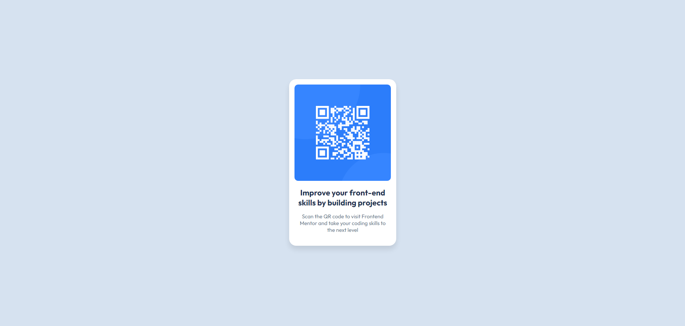

# Frontend Mentor - QR code component solution

This is a solution to the [QR code component challenge on Frontend Mentor](https://www.frontendmentor.io/challenges/qr-code-component-iux_sIO_H). Frontend Mentor challenges help you improve your coding skills by building realistic projects.

## Table of contents

- [Overview](#overview)
  - [Screenshot](#screenshot)
  - [Links](#links)
- [My process](#my-process)
  - [Built with](#built-with)
  - [What I learned](#what-i-learned)
  - [Continued development](#continued-development)
  - [Useful resources](#useful-resources)
- [Author](#author)

**Note: Delete this note and update the table of contents based on what sections you keep.**

## Overview

### Screenshot



### Links

- Live site URL: [Add live site URL here](https://your-solution-url.com)

## My process

### Built with

- Semantic HTML5 markup
- Basic CSS
- Flexbox

### What I learned

Here are some of the things that I learned while doing this challenge.

- How to center a div (with flexbox). Make sure the html body takes the full height of the browser. Otherwise it will not vertically center it. 

```css
.body {
  min-height: 100dvh;
	display: flex;
  justify-content: center;
  align-items: center
}
```

- How to make it responsive (with media query). When the browser gets to a small screen size change the width of the card.

```html
  <main class="card">
			
			<h1>Improve your front-end skills by building projects</h1>
			<p>
				Scan the QR code to visit Frontend Mentor and take your coding skills to
				the next level
			</p>
		</main>
```

```css
  @media only screen and (max-width: 330px) {
    .card {
      width: 70%;
    }
  }
```

### Continued development

The things that i want to focus on the future projects are:

- Flexbox - I want to understand more how flex-grow, flex-shrink and flex-basis work.
- Grid - I want to understand how to use grid to make complex layout
- Decide when to use flexbox and grid and what are their advantages and disadvantages
- Responsive CSS - I want to know the methods of making the website more responsive

### Useful resources

- [Semantic html](https://www.w3schools.com/html/html5_semantic_elements.asp) - This website helped me to figure out which semantic tag tu use. It also describes what each tag is used for

## Author

- Frontend Mentor - [@tadanama](https://www.frontendmentor.io/profile/tadanama)
